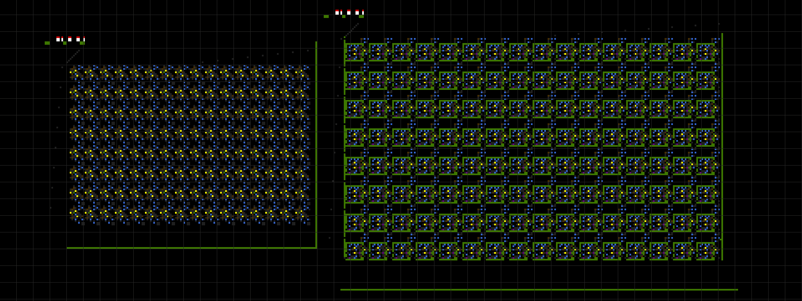
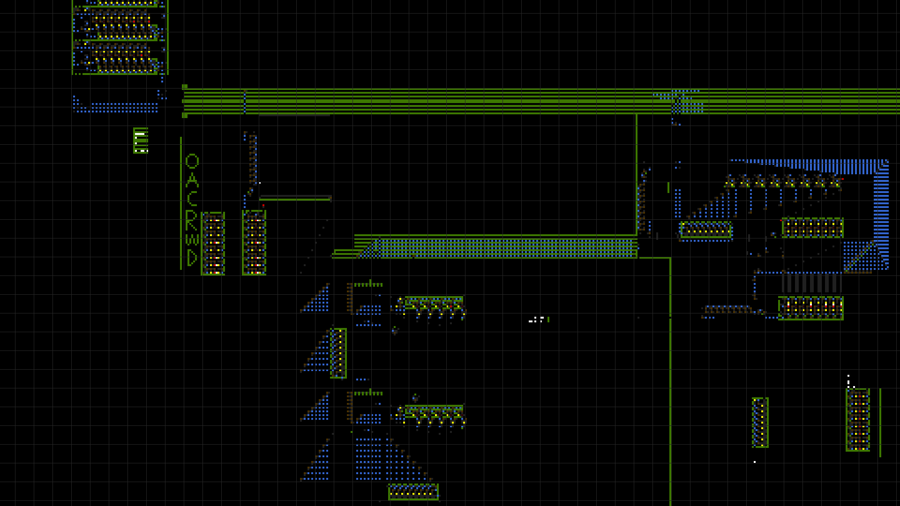
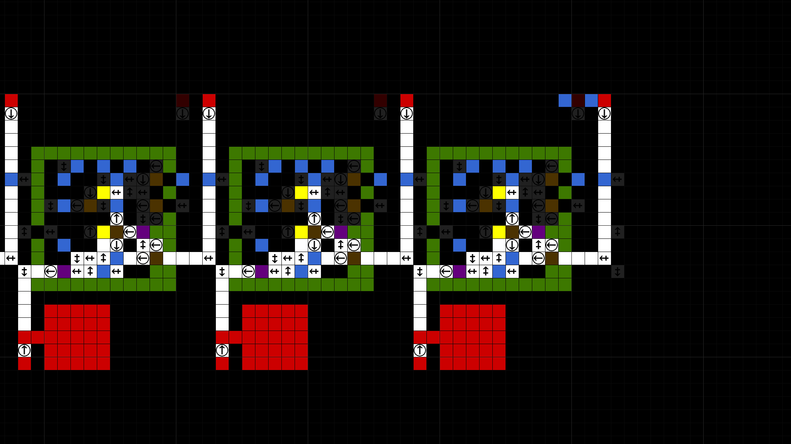

# Cellular Automaton CPU

__Project creation date:__ 08.09.2018

## Description
This project is the successor of the project Cellular Automaton GPU and aims to improve the performance of the simulation and ease of use.\
The simulation is done on the CPU and only the changes of each simulation step are calculated.

## Rules
There are 8 diffrent types of cells:
1. __White cell:__ The main cell which moves each simulation step one pixel in their direction.
2. __Green cell:__ Only used to kill white cells.
3. __Blue cell:__ Used to make white cells jump over them to create junctions.
4. __Yellow cell:__ AND gate
5. __Brown cell:__ OR gate
6. __Purple cell:__ XOR gate
7. __Light & dark red cell:__ Used to store data. ON state is light red and OFF is dark red.

__Additionaly there are direction and output arrows:__\
The direction arrows change the direction of white cells.\
The output arrows are for defining the outputs of logic gates and in which direction the white cells should be emitted.\
There are normal and inverted outputs for each direction.

## Technologies
* C#
* MonoGame

## Pictures

***

***

